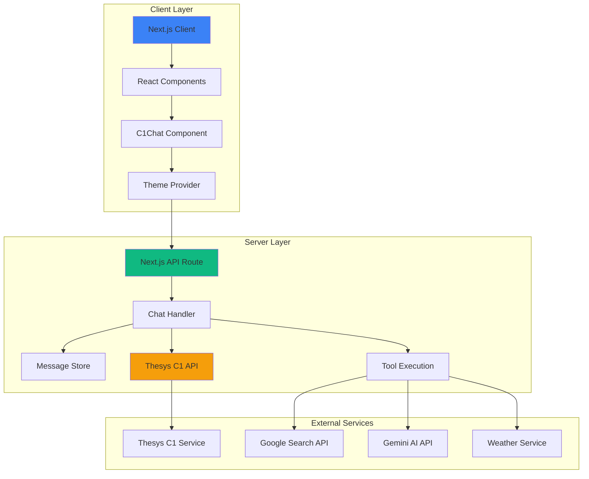
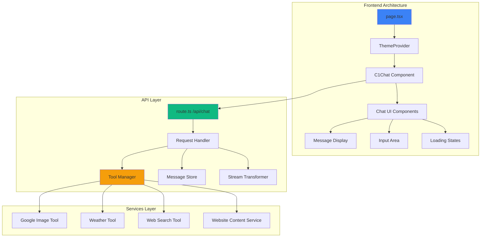
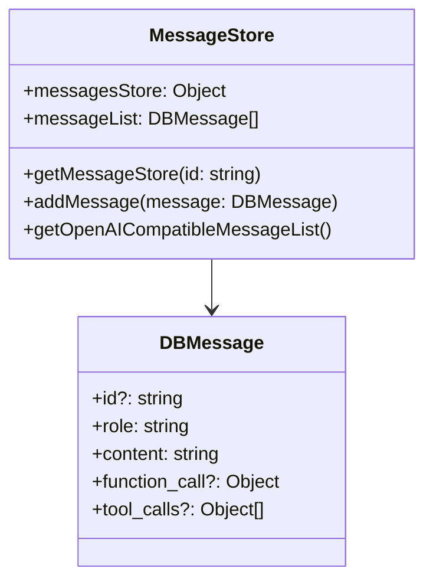
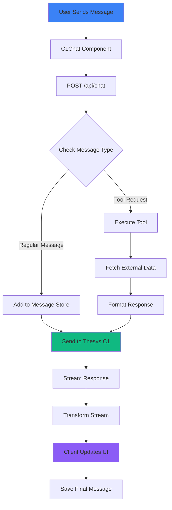
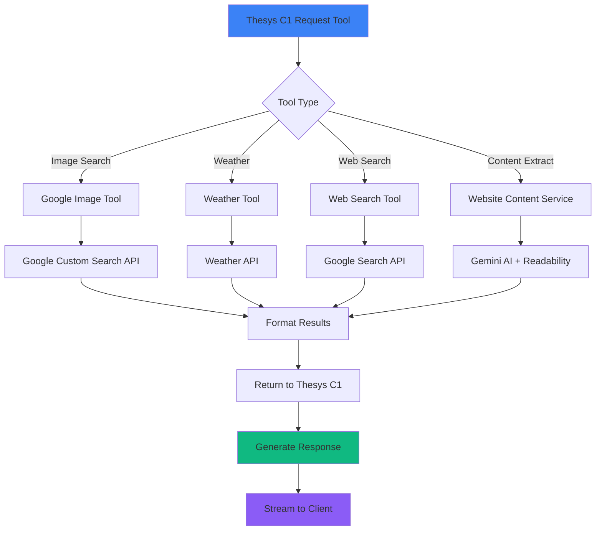
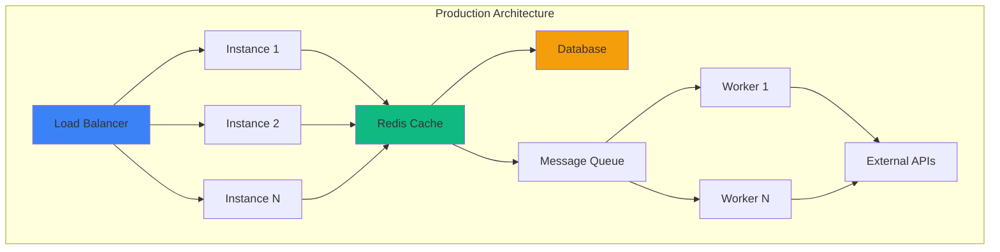
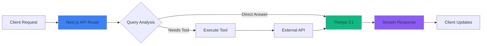

# Product Requirements Document (PRD)
## C1 Generative UI Chat Application

**Version:** 1.0  
**Date:** October 2025  
**Project:** Template C1 Next.js Chat Application  
**Technology Stack:** Next.js 15, React 19, TypeScript, Thesys C1

---

## 1. Executive Summary

### 1.1 Product Overview
The C1 Generative UI Chat Application is an AI-powered conversational interface that leverages Thesys C1's generative capabilities to create dynamic, interactive user interfaces in real-time through natural language conversations. The application enables users to interact with an AI assistant that can fetch information, generate images, provide weather updates, and render rich UI components dynamically.

### 1.2 Key Features
- **Real-time Conversational AI** - Natural language chat interface powered by Thesys C1
- **Tool Integration** - Access to web search, image generation, weather data, and website content
- **Generative UI Components** - Dynamic UI elements created based on conversation context
- **Streaming Responses** - Server-sent events for real-time content delivery
- **Session Management** - Thread-based conversation history
- **Multi-API Integration** - Google Search, Gemini AI, and custom tools

### 1.3 Success Metrics
- Response time: < 2 seconds for initial streaming
- Uptime: 99.9%
- API integration success rate: > 95%
- User satisfaction score: > 4.5/5

---

## 2. System Architecture

### 2.1 High-Level Architecture



### 2.2 Component Architecture



---

## 3. Detailed System Components

### 3.1 Frontend Components

#### 3.1.1 Core Pages

**File: `src/app/page.tsx`**
- **Purpose:** Main entry point for the chat interface
- **Key Features:**
  - Theme configuration with custom typography
  - C1Chat component integration
  - Dark theme support
  - Responsive layout

**File: `src/app/layout.tsx`**
- **Purpose:** Root layout wrapper
- **Key Features:**
  - Font loading and optimization
  - Metadata configuration
  - Global CSS injection

#### 3.1.2 Styling & Theming

**File: `src/app/globals.css`**
- **Purpose:** Global styles and theme tokens
- **Key Features:**
  - CSS custom properties for theming
  - Dark/light mode support
  - Tailwind CSS integration

**File: `src/app/font.ts`**
- **Purpose:** Font configuration
- **Supported Fonts:** Inter, Roboto, Geist, Open Sans, and 17 other Google Fonts

### 3.2 API Architecture

#### 3.2.1 Chat API Route

**File: `src/app/api/chat/route.ts`**
- **Endpoint:** `POST /api/chat`
- **Purpose:** Main chat handler for AI interactions
- **Flow:**

```mermaid
sequenceDiagram
    participant Client
    participant API as API Route
    participant Store as Message Store
    participant C1 as Thesys C1
    participant Tools as Tool Manager
    participant Stream as Stream Transformer
    
    Client->>API: POST /api/chat (prompt, threadId, responseId)
    API->>Store: addMessage(prompt)
    API->>Store: getOpenAICompatibleMessageList()
    API->>C1: chat.completions.runTools()
    
    alt Tool Required
        C1->>Tools: Execute Tool
        Tools->>External: Fetch Data
        External->>Tools: Return Results
        Tools->>C1: Tool Response
    end
    
    C1->>Stream: Stream Response
    Stream->>Client: SSE Stream
    Stream->>Store: Save Final Response
    
    style API fill:#3b82f6
    style C1 fill:#10b981
    style Tools fill:#f59e0b
```

**Key Implementation Details:**
- Uses Thesys C1 API with GPT-5 model
- Streaming response via Server-Sent Events (SSE)
- Thread-based message storage
- Automatic tool execution
- Temperature: 1 (creative responses)

#### 3.2.2 Message Store

**File: `src/app/api/chat/messageStore.ts`**
- **Purpose:** In-memory conversation management
- **Key Features:**
  - Thread-based storage
  - Message history tracking
  - OpenAI-compatible format conversion
  - Automatic cleanup capability



#### 3.2.3 Tool System

**File: `src/app/api/chat/tools.ts`**
- **Purpose:** Tool registry and management
- **Current Tools:**
  1. Google Image Search Tool
  2. Weather Tool
  3. Web Search Tool (via services)

```mermaid
classDiagram
    class ToolRegistry {
        +tools: RunnableToolFunction[]
        +registerTool(tool: Tool)
        +executeTool(name: string, args: any)
    }
    
    class GoogleImageTool {
        +name: "imageSearch"
        +description: string
        +parse(args: {altText: string[]})
        +function(params)
    }
    
    class WeatherTool {
        +name: "getWeather"
        +description: string
        +parse(args: {location: string})
        +function(params)
    }
    
    ToolRegistry --> GoogleImageTool
    ToolRegistry --> WeatherTool
```

**Individual Tool Implementations:**

1. **Google Image Search** (`src/app/api/chat/tools/googleImage.ts`)
   - Fetches image URLs from Google Custom Search
   - Returns both thumbnail and full-size images
   - Error handling with user-friendly messages

2. **Weather Tool** (`src/app/api/chat/tools/weather.ts`)
   - Provides current weather information
   - Location-based queries
   - Real-time data fetching

3. **Web Search Tool** (`src/app/api/chat/tools/webSearchTool.ts`)
   - Performs web searches via Google Custom Search API
   - Returns formatted search results
   - URL extraction and validation

#### 3.2.4 Services Layer

**Google Search Service** (`src/app/api/chat/services/googleSearch.ts`)
- Web search functionality
- Image search support
- Configurable search parameters
- Rate limiting and error handling

**Website Content Service** (`src/app/api/chat/services/websiteContent.ts`)
- Content extraction from URLs
- Readability parsing
- Gemini AI summarization
- Timeout and error handling

---

## 4. Data Flow

### 4.1 User Message Processing Flow



### 4.2 Tool Execution Flow



---

## 5. Technology Stack

### 5.1 Core Technologies

| Technology | Version | Purpose |
|------------|---------|---------|
| Next.js | 15.2.4 | React framework with SSR/SSG |
| React | 19.0.0 | UI library |
| TypeScript | 5.x | Type safety |
| Tailwind CSS | 4.x | Styling |
| Thesys C1 | Latest | Generative UI SDK |

### 5.2 Key Dependencies

**AI & ML:**
- `@thesysai/genui-sdk` - Thesys C1 integration
- `@crayonai/react-ui` - React UI components
- `openai` - OpenAI API client

**Services:**
- `axios` - HTTP client
- `google-images` - Google image search
- `@google/genai` - Google Gemini API

**Utilities:**
- `@mozilla/readability` - Content extraction
- `jsdom` - DOM manipulation
- `zod` - Schema validation
- `zod-to-json-schema` - Schema conversion

### 5.3 Development Tools

- `eslint` - Code linting
- `prettier` - Code formatting
- `lightningcss` - CSS optimization
- Turbopack - Fast bundler

---

## 6. Environment Configuration

### 6.1 Required Environment Variables

```bash
# Thesys C1 API Key (Required)
THESYS_API_KEY=your_thesys_api_key_here

# Google Custom Search (Required for search/image tools)
GOOGLE_API_KEY=your_google_api_key_here
GOOGLE_CX_KEY=your_google_custom_search_id_here

# Gemini AI (Required for content summarization)
GEMINI_API_KEY=your_gemini_api_key_here
```

### 6.2 API Key Setup

1. **Thesys API Key**
   - Get from: https://chat.thesys.dev/console/keys
   - Purpose: Access Thesys C1 services

2. **Google API Keys**
   - Setup: https://developers.google.com/custom-search/v1/introduction
   - Purpose: Web search and image search

3. **Gemini API Key**
   - Get from: https://aistudio.google.com/apikey
   - Purpose: Content summarization

---

## 7. API Specifications

### 7.1 Chat API Endpoint

**Endpoint:** `POST /api/chat`

**Request Body:**
```typescript
{
  prompt: DBMessage,
  threadId: string,
  responseId: string
}

type DBMessage = {
  role: "user" | "assistant" | "function" | "system" | "tool",
  content: string,
  id?: string,
  function_call?: object,
  tool_calls?: object[]
}
```

**Response:** Server-Sent Events (SSE) stream

**Response Format:**
```
Content-Type: text/event-stream
Connection: keep-alive
Cache-Control: no-cache, no-transform
```

### 7.2 Thesys C1 API Integration

**Base URL:** `https://api.thesys.dev/v1/embed/`

**Model:** `c1/openai/gpt-5/v-20250930`

**Parameters:**
- Temperature: 1
- Streaming: true
- Tool choice: auto

---

## 8. Security Considerations

### 8.1 API Key Security
- Environment variables stored in `.env` file
- `.env` excluded from version control
- Never commit API keys to repository

### 8.2 Request Validation
- Input sanitization for user messages
- Schema validation using Zod
- Rate limiting recommendations

### 8.3 Error Handling
- Graceful degradation for API failures
- User-friendly error messages
- No sensitive data in error responses

---

## 9. Performance Optimization

### 9.1 Streaming Architecture
- Server-Sent Events for real-time responses
- Chunked data delivery
- Immediate UI updates

### 9.2 Caching Strategy
- Message store for conversation history
- In-memory storage for session data
- Future: Redis for persistence

### 9.3 Code Optimization
- Turbopack for fast development builds
- Tree shaking for production
- Code splitting via Next.js

---

## 10. Scalability Considerations

### 10.1 Current Limitations
- In-memory message store (not persistent)
- Single instance deployment
- No load balancing

### 10.2 Recommended Enhancements
- **Database Integration**: PostgreSQL/MongoDB for message storage
- **Cache Layer**: Redis for session management
- **Horizontal Scaling**: Load balancer + multiple instances
- **Queue System**: BullMQ for background job processing
- **CDN**: Static asset delivery optimization

### 10.3 Scaling Architecture



---

## 11. Development Workflow

### 11.1 Local Development

```bash
# Install dependencies
npm install

# Setup environment
cp .env.example .env
# Add API keys to .env

# Run development server
npm run dev

# Build for production
npm run build

# Start production server
npm start
```

### 11.2 Deployment Options

**Vercel (Recommended)**
- One-click deployment
- Automatic SSL
- Serverless architecture
- Environment variable management

**Self-Hosted**
- Docker containerization
- Kubernetes orchestration
- Custom server setup

---

## 12. Monitoring & Logging

### 12.1 Recommended Monitoring
- API response times
- Error rates
- Tool execution success rates
- User session metrics

### 12.2 Logging Strategy
- Structured logging with Winston/Pino
- Error tracking with Sentry
- Performance monitoring with Datadog

---

## 13. Future Enhancements

### 13.1 Planned Features
1. **Persistent Storage** - Database integration for message history
2. **User Authentication** - Login/signup functionality
3. **Multi-language Support** - i18n implementation
4. **Voice Input** - Speech-to-text integration
5. **Advanced Tools** - Calendar, email, file upload
6. **Admin Dashboard** - Analytics and management

### 13.2 Tool Expansion
- Calendar management
- Email integration
- Document processing
- Code execution
- API integrations

---

## 14. Testing Strategy

### 14.1 Unit Tests
- Component testing with Jest/React Testing Library
- API route testing
- Tool function testing

### 14.2 Integration Tests
- End-to-end chat flows
- Tool execution flows
- Stream handling tests

### 14.3 Manual Testing Checklist
- [ ] Basic chat functionality
- [ ] Image search tool
- [ ] Weather tool
- [ ] Web search tool
- [ ] Error handling
- [ ] Stream interruption recovery
- [ ] Mobile responsiveness

---

## 15. Support & Documentation

### 15.1 Developer Documentation
- Code comments
- README with setup instructions
- API documentation
- Architecture diagrams (this document)

### 15.2 User Documentation
- Feature guides
- API key setup
- Troubleshooting tips

---

## 16. Appendix

### 16.1 Directory Structure

```
template-c1-next/
├── src/
│   ├── app/
│   │   ├── api/
│   │   │   └── chat/
│   │   │       ├── route.ts                 # Main API handler
│   │   │       ├── messageStore.ts           # Message management
│   │   │       ├── tools.ts                  # Tool registry
│   │   │       ├── systemPrompts.ts         # AI prompts
│   │   │       ├── services/                # Service layer
│   │   │       │   ├── googleSearch.ts
│   │   │       │   └── websiteContent.ts
│   │   │       └── tools/                   # Tool implementations
│   │   │           ├── googleImage.ts
│   │   │           ├── weather.ts
│   │   │           └── webSearchTool.ts
│   │   ├── font.ts                          # Font configuration
│   │   ├── globals.css                      # Global styles
│   │   ├── layout.tsx                       # Root layout
│   │   └── page.tsx                         # Home page
├── public/                                  # Static assets
├── .env.example                             # Environment template
├── package.json                             # Dependencies
├── tsconfig.json                            # TypeScript config
└── next.config.ts                           # Next.js config
```

### 16.2 Key Files Reference

| File | Purpose | Key Functions |
|------|---------|---------------|
| `route.ts` | Chat API handler | POST endpoint, streaming, tool execution |
| `messageStore.ts` | Message management | Thread storage, message history |
| `tools.ts` | Tool registry | Tool collection and execution |
| `googleImage.ts` | Image search | Google Custom Search API |
| `weather.ts` | Weather data | Weather API integration |
| `systemPrompts.ts` | AI prompts | System instructions for C1 |
| `page.tsx` | Frontend entry | Theme setup, C1Chat component |

### 16.3 API Integration Flow



---

**Document Version:** 1.0  
**Last Updated:** October 2025  
**Maintainer:** Development Team  
**Review Cycle:** Quarterly

