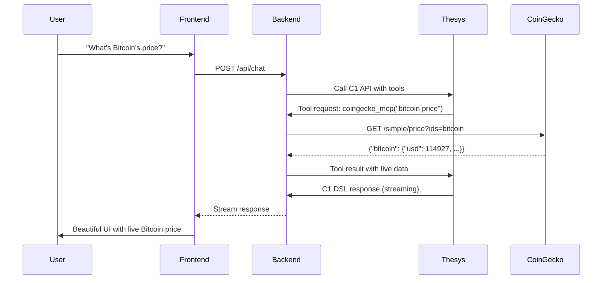

# Complete Implementation Guide: Live CoinGecko Integration with Thesys C1

## Overview

This guide documents the complete implementation of a chat application that:
1. Uses **Thesys C1 API** for AI-powered responses
2. Integrates with **CoinGecko API** for live cryptocurrency data
3. Streams responses in real-time
4. Renders beautiful UI components using **GenUI**

---

## Architecture

```
┌─────────────┐     ┌──────────────┐     ┌──────────────┐     ┌─────────────┐
│   Frontend  │────▶│   Backend    │────▶│  Thesys C1  │────▶│  CoinGecko  │
│   React     │◀────│  FastAPI     │◀────│     API     │◀────│     API     │
└─────────────┘     └──────────────┘     └──────────────┘     └─────────────┘
     │                    │                     │
     └────────────────────┼─────────────────────┘
                          │
                     Tool Calling
                     + Streaming
```

---

## Step-by-Step Implementation

### Part 1: Backend Setup (Python FastAPI)

#### Step 1.1: Project Structure

Create the project structure:
```
demo/
├── backend/
│   ├── main.py          # FastAPI app
│   ├── tools.py         # CoinGecko integration
│   ├── system_prompt.py # AI instructions
│   ├── requirements.txt # Dependencies
│   └── .env            # API keys
└── frontend/
    ├── src/
    │   ├── App.tsx     # React chat UI
    │   └── App.css      # Styles
    └── package.json    # Dependencies
```

#### Step 1.2: Install Dependencies

**Backend (`requirements.txt`)**:
```txt
fastapi==0.104.1
uvicorn[standard]==0.24.0
python-dotenv==1.0.0
openai>=1.50.0
python-multipart==0.0.6
requests>=2.31.0
```

Install:
```bash
cd demo/backend
python -m venv venv
source venv/bin/activate  # On Windows: venv\Scripts\activate
pip install -r requirements.txt
```

**Frontend (`package.json`)**:
```json
{
  "dependencies": {
    "react": "^18.2.0",
    "react-dom": "^18.2.0",
    "vite": "^5.0.0",
    "@thesysai/genui-sdk": "^latest",
    "@crayonai/react-ui": "^latest",
    "react-markdown": "^latest"
  }
}
```

Install:
```bash
cd demo/frontend
npm install
```

#### Step 1.3: Configure Environment

Create `demo/backend/.env`:
```env
THESYS_API_KEY=sk-th-your_thesys_api_key_here
```

---

### Part 2: Backend Implementation

#### Step 2.1: Main FastAPI Application (`main.py`)

```python
import os
from fastapi import FastAPI, HTTPException
from fastapi.responses import StreamingResponse
from fastapi.middleware.cors import CORSMiddleware
from pydantic import BaseModel
from dotenv import load_dotenv
from openai import OpenAI
from typing import List, Dict, Any
import json

# Load environment variables
load_dotenv()

# Import tools and system prompt
from tools import tools, tool_impls
from system_prompt import SYSTEM_PROMPT

app = FastAPI()

# Enable CORS for local development
app.add_middleware(
    CORSMiddleware,
    allow_origins=["http://localhost:5173", "http://127.0.0.1:5173"],
    allow_credentials=True,
    allow_methods=["*"],
    allow_headers=["*"],
)

# Initialize OpenAI client with Thesys endpoint
client = OpenAI(
    api_key=os.getenv('THESYS_API_KEY'),
    base_url='https://api.thesys.dev/v1/embed'
)

# In-memory storage for conversation history
conversations: Dict[str, List[Dict]] = {}

class ChatRequest(BaseModel):
    message: str
    threadId: str = "default"

@app.post("/api/chat")
async def chat(request: ChatRequest):
    """Chat endpoint with streaming support and tool calling"""
    
    if not os.getenv('THESYS_API_KEY'):
        raise HTTPException(status_code=500, detail="THESYS_API_KEY not configured")
    
    thread_id = request.threadId
    
    # Initialize conversation if it doesn't exist
    if thread_id not in conversations:
        conversations[thread_id] = [{"role": "system", "content": SYSTEM_PROMPT}]
    
    # Add user message to conversation history
    conversations[thread_id].append({
        "role": "user",
        "content": request.message
    })
    
    # Get conversation history
    messages = conversations[thread_id]
    
    try:
        def generate():
            """Generator function for streaming responses with tool calling support"""
            nonlocal messages
            
            while True:
                # Debug: Log what we're sending to Thesys
                print(f"\n📤 Sending to Thesys: {len(tools)} tools available")
                print(f"📤 Message count: {len(messages)}")
                
                # Call Thesys C1 API with streaming and GenUI
                stream = client.chat.completions.create(
                    model='c1/anthropic/claude-sonnet-4/v-20250815',
                    messages=messages,
                    tools=tools,
                    stream=True,
                    temperature=0.7,
                    max_tokens=4000
                )
                
                assistant_response = ""
                assistant_message = {"role": "assistant", "content": "", "tool_calls": []}
                finish_reason = None
                
                for chunk in stream:
                    # Handle content chunks
                    if chunk.choices[0].delta.content:
                        content = chunk.choices[0].delta.content
                        assistant_response += content
                        yield f"data: {json.dumps({'content': content, 'done': False})}\n\n"
                    
                    # Handle tool calls
                    if chunk.choices[0].delta.tool_calls:
                        tool_calls = chunk.choices[0].delta.tool_calls
                        for tool_call in tool_calls:
                            idx = tool_call.index
                            if len(assistant_message["tool_calls"]) <= idx:
                                assistant_message["tool_calls"].append({
                                    "id": tool_call.id if hasattr(tool_call, 'id') else None,
                                    "type": "function",
                                    "function": {"name": "", "arguments": ""}
                                })
                            
                            if hasattr(tool_call.function, 'name') and tool_call.function.name:
                                assistant_message["tool_calls"][idx]["function"]["name"] = tool_call.function.name
                            if hasattr(tool_call.function, 'arguments') and tool_call.function.arguments:
                                assistant_message["tool_calls"][idx]["function"]["arguments"] += tool_call.function.arguments
                    
                    # Track finish reason
                    if chunk.choices[0].finish_reason:
                        finish_reason = chunk.choices[0].finish_reason
                
                # Handle finish
                assistant_message["content"] = assistant_response
                messages.append(assistant_message)
                
                # Check if model wants to call tools
                if finish_reason == "tool_calls" and assistant_message["tool_calls"]:
                    print(f"🔧 Model wants to call {len(assistant_message['tool_calls'])} tool(s)")
                    
                    # Execute tool calls
                    for tool_call in assistant_message["tool_calls"]:
                        try:
                            name = tool_call["function"]["name"]
                            args = json.loads(tool_call["function"]["arguments"])
                            
                            print(f"⚙️ Executing tool: {name} with args: {args}")
                            
                            # Show that tool is being executed
                            yield f"data: {json.dumps({'content': f'🔍 Using {name}...\n', 'done': False})}\n\n"
                            
                            # Execute the tool
                            result = tool_impls[name](**args)
                            
                            print(f"✅ Tool result: {result[:100]}...")
                            
                            # Format tool result as plain string (per OpenAI docs)
                            if isinstance(result, dict):
                                result_str = json.dumps(result)
                            elif isinstance(result, str):
                                result_str = result
                            else:
                                result_str = str(result)
                            
                            # Add tool result to conversation
                            messages.append({
                                "role": "tool",
                                "tool_call_id": tool_call["id"],
                                "content": result_str
                            })
                        except KeyError as e:
                            print(f"❌ KeyError: {e}")
                            yield f"data: {json.dumps({'content': f'❌ Tool {name} not found\n', 'done': False})}\n\n"
                        except json.JSONDecodeError as e:
                            print(f"❌ JSONDecodeError: {e}")
                            yield f"data: {json.dumps({'content': f'❌ Invalid tool arguments\n', 'done': False})}\n\n"
                        except Exception as e:
                            print(f"❌ Tool execution error: {e}")
                            yield f"data: {json.dumps({'content': f'❌ Tool error: {str(e)}\n', 'done': False})}\n\n"
                    
                    # After tools executed, continue to get final response
                    continue
                
                # No tool calls, done
                yield f"data: {json.dumps({'content': '', 'done': True})}\n\n"
                break
        
        return StreamingResponse(
            generate(),
            media_type="text/event-stream",
            headers={
                "Cache-Control": "no-cache",
                "Connection": "keep-alive",
                "X-Accel-Buffering": "no"
            }
        )
    
    except Exception as e:
        raise HTTPException(status_code=500, detail=str(e))

@app.get("/health")
async def health():
    return {"status": "healthy", "api_configured": bool(os.getenv('THESYS_API_KEY'))}

if __name__ == "__main__":
    import uvicorn
    uvicorn.run(app, host="0.0.0.0", port=8000)
```

#### Step 2.2: CoinGecko Tool Implementation (`tools.py`)

```python
import os
from typing import Dict, Callable, Any
import json
import requests

def coingecko_mcp(query: str) -> str:
    """
    Get real cryptocurrency data from CoinGecko API.
    
    This fetches live data from CoinGecko's public API (no key required for basic data).
    
    Args:
        query: Search query for cryptocurrency (e.g., "bitcoin price", "ethereum", "trending")
    """
    try:
        print(f"🪙 CoinGecko API: {query}")
        
        query_lower = query.lower()
        
        # Determine what data to fetch
        if "bitcoin" in query_lower or "btc" in query_lower:
            coin_id = "bitcoin"
        elif "ethereum" in query_lower or "eth" in query_lower:
            coin_id = "ethereum"
        elif "solana" in query_lower or "sol" in query_lower:
            coin_id = "solana"
        else:
            coin_id = "bitcoin"  # Default to bitcoin
        
        # Fetch real-time data from CoinGecko API (free, public)
        api_url = f"https://api.coingecko.com/api/v3/simple/price?ids={coin_id}&vs_currencies=usd&include_market_cap=true&include_24hr_change=true"
        
        print(f"🌐 Calling CoinGecko API: {api_url}")
        
        response = requests.get(api_url, timeout=10)
        
        if response.status_code == 200:
            data = response.json()
            coin_data = data.get(coin_id, {})
            
            # Format the data nicely
            result = {
                "coin": coin_id.title(),
                "price": f"${coin_data.get('usd', 0):,.2f}",
                "market_cap": f"${coin_data.get('usd_market_cap', 0):,.0f}",
                "24h_change": f"{coin_data.get('usd_24h_change', 0):.2f}%",
                "raw_data": coin_data,
                "source": "CoinGecko API (Live Data)"
            }
            
            print(f"✅ Fetched real data: {result}")
            
            return json.dumps({
                "data": result,
                "timestamp": data.get("timestamp", "live"),
                "source": "CoinGecko API"
            })
        else:
            print(f"⚠️ API returned {response.status_code}")
            # Fallback to mock data
            return _get_mock_data(query_lower)
            
    except requests.exceptions.Timeout:
        print("⏱️ API timeout")
        return _get_mock_data(query_lower)
    except Exception as e:
        print(f"❌ Error: {e}")
        return _get_mock_data(query_lower)

def _get_mock_data(query_lower: str) -> str:
    """Fallback mock data if API fails"""
    if "bitcoin" in query_lower or "btc" in query_lower:
        data = {
            "coin": "Bitcoin",
            "symbol": "BTC",
            "price": "$95,000",
            "market_cap": "$1.8T",
            "24h_change": "+2.5%",
            "note": "Mock data - API unavailable"
        }
    elif "ethereum" in query_lower or "eth" in query_lower:
        data = {
            "coin": "Ethereum",
            "symbol": "ETH",
            "price": "$3,500",
            "market_cap": "$420B",
            "24h_change": "+1.8%",
            "note": "Mock data - API unavailable"
        }
    elif "trending" in query_lower or "top" in query_lower:
        data = {
            "coins": [
                {"name": "Bitcoin", "symbol": "BTC", "price": "$95,000", "24h": "+2.5%"},
                {"name": "Ethereum", "symbol": "ETH", "price": "$3,500", "24h": "+1.8%"},
                {"name": "Solana", "symbol": "SOL", "price": "$185", "24h": "+4.2%"}
            ],
            "note": "Mock data - API unavailable"
        }
    else:
        data = {
            "query": query_lower,
            "message": "Please specify a cryptocurrency (e.g., 'bitcoin', 'ethereum')",
            "examples": ["bitcoin price", "ethereum market cap", "trending coins"]
        }
    
    return json.dumps({
        "data": data,
        "source": "Fallback"
    })

# Define the tools schema for OpenAI function calling
tools = [
    {
        "type": "function",
        "function": {
            "name": "coingecko_mcp",
            "description": "Get real-time cryptocurrency market data from CoinGecko. Use this for crypto prices, market cap, trading volume, trending coins, or any cryptocurrency information. Examples: 'bitcoin price', 'ethereum market cap', 'top trending coins'.",
            "parameters": {
                "type": "object",
                "properties": {
                    "query": {
                        "type": "string",
                        "description": "Search query for cryptocurrency (e.g., 'bitcoin price', 'ethereum market cap', 'trending coins').",
                    }
                },
                "required": ["query"],
                "additionalProperties": False,
            },
            "strict": True,
        },
    }
]

# Map function names to implementations
tool_impls: Dict[str, Callable[..., str]] = {
    "coingecko_mcp": coingecko_mcp,
}
```

#### Step 2.3: System Prompt (`system_prompt.py`)

```python
SYSTEM_PROMPT = """You are a helpful crypto market assistant that uses the CoinGecko MCP server to provide real-time cryptocurrency data.
When users ask about crypto prices, market data, trending coins, or any cryptocurrency information,
use the coingecko_mcp tool to get the latest data from CoinGecko, then present the results in a clear, helpful format.

Always format your responses using the C1 DSL to create beautiful, interactive UI components with charts, tables, and cards."""
```

---

### Part 3: Frontend Implementation

#### Step 3.1: React Chat Application (`frontend/src/App.tsx`)

```typescript
import { useState, useRef, useEffect } from 'react'
import { C1Component, ThemeProvider } from '@thesysai/genui-sdk'
import '@crayonai/react-ui/styles/index.css'
import './App.css'

interface Message {
  id: string
  role: 'user' | 'assistant'
  content: string
}

function App() {
  const [messages, setMessages] = useState<Message[]>([])
  const [input, setInput] = useState('')
  const [isLoading, setIsLoading] = useState(false)
  const messagesEndRef = useRef<HTMLDivElement>(null)
  const threadId = useRef(`thread_${Date.now()}`)
  const currentAssistantMessageId = useRef<string | null>(null)

  useEffect(() => {
    messagesEndRef.current?.scrollIntoView({ behavior: 'smooth' })
  }, [messages])

  const sendMessage = async () => {
    if (!input.trim() || isLoading) return

    const userMessage: Message = {
      id: Date.now().toString(),
      role: 'user',
      content: input
    }

    setMessages(prev => [...prev, userMessage])
    setInput('')
    setIsLoading(true)

    // Create assistant message placeholder
    const assistantMessage: Message = {
      id: (Date.now() + 1).toString(),
      role: 'assistant',
      content: ''
    }
    currentAssistantMessageId.current = assistantMessage.id
    setMessages(prev => [...prev, assistantMessage])

    try {
      const response = await fetch('/api/chat', {
        method: 'POST',
        headers: {
          'Content-Type': 'application/json',
        },
        body: JSON.stringify({
          message: userMessage.content,
          threadId: threadId.current
        })
      })

      if (!response.ok) throw new Error('Failed to send message')

      const reader = response.body?.getReader()
      if (!reader) throw new Error('No response body')

      let accumulatedContent = ''

      while (true) {
        const { done, value } = await reader.read()
        if (done) break

        const chunk = new TextDecoder().decode(value)
        const lines = chunk.split('\n')

        for (const line of lines) {
          if (line.startsWith('data: ')) {
            try {
              const data = JSON.parse(line.substring(6))
              
              if (data.content) {
                accumulatedContent += data.content
                
                // Update state immediately to trigger re-render
                setMessages(prev => 
                  prev.map(msg => 
                    msg.id === assistantMessage.id
                      ? { ...msg, content: accumulatedContent }
                      : msg
                  )
                )
              }

              if (data.done) {
                setIsLoading(false)
              }
            } catch (e) {
              // Ignore parsing errors
            }
          }
        }
      }
    } catch (error) {
      console.error('Error:', error)
      setIsLoading(false)
      setMessages(prev => 
        prev.map(msg => 
          msg.id === assistantMessage.id
            ? { ...msg, content: 'Error: Failed to get response. Please try again.' }
            : msg
        )
      )
    }
  }

  const handleKeyPress = (e: React.KeyboardEvent) => {
    if (e.key === 'Enter' && !e.shiftKey) {
      e.preventDefault()
      sendMessage()
    }
  }

  return (
    <ThemeProvider>
      <div className="app">
        <div className="chat-container">
          <div className="chat-header">
            <h1>✨ Thesys C1 Chat</h1>
            <p>Powered by Claude Sonnet 4 via Thesys with CoinGecko Data</p>
          </div>

          <div className="messages">
            {messages.map((message) => {
              let displayContent = message.content
              let c1Response = null
              
              if (message.role === 'assistant' && message.content) {
                // Look for JSON wrapped in <content> tags
                const contentMatch = message.content.match(/<content>(.*?)<\/content>/s)
                if (contentMatch) {
                  try {
                    // Unescape HTML entities and parse JSON
                    c1Response = contentMatch[1]
                      .replace(/&quot;/g, '"')
                      .replace(/&#39;/g, "'")
                      .replace(/&amp;/g, '&')
                      .replace(/&lt;/g, '<')
                      .replace(/&gt;/g, '>')
                    
                    // Try to parse to validate it's complete JSON
                    JSON.parse(c1Response)
                  } catch (e) {
                    // JSON might be incomplete during streaming
                    // Try to extract partial JSON anyway
                    const partialMatch = contentMatch[1]
                      .replace(/&quot;/g, '"')
                      .replace(/&#39;/g, "'")
                      .replace(/&amp;/g, '&')
                      .replace(/&lt;/g, '<')
                      .replace(/&gt;/g, '>')
                    
                    // Only use if it looks like JSON structure
                    if (partialMatch.trim().startsWith('{')) {
                      c1Response = partialMatch
                    }
                  }
                }
              }
              
              return (
                <div key={message.id} className={`message ${message.role}`}>
                  {c1Response ? (
                    <div className="message-content">
                      <C1Component 
                        c1Response={c1Response} 
                        isStreaming={isLoading && message.id === currentAssistantMessageId.current}
                      />
                    </div>
                  ) : (
                    <div className="message-content" style={{ whiteSpace: 'pre-wrap' }}>
                      {displayContent || (message.role === 'assistant' && isLoading && 'Thinking...')}
                    </div>
                  )}
                </div>
              )
            })}
            <div ref={messagesEndRef} />
          </div>

          <div className="input-area">
            <textarea
              value={input}
              onChange={(e) => setInput(e.target.value)}
              onKeyPress={handleKeyPress}
              placeholder="Ask about cryptocurrency prices..."
              rows={2}
              disabled={isLoading}
            />
            <button
              onClick={sendMessage}
              disabled={isLoading || !input.trim()}
              className="send-button"
            >
              {isLoading ? '⏳' : 'Send'}
            </button>
          </div>
        </div>
      </div>
    </ThemeProvider>
  )
}

export default App
```

---

## How It Works (Flow Diagram)



---

## Testing the Implementation

### Start Backend
```bash
cd demo/backend
source venv/bin/activate
python main.py
```

### Start Frontend
```bash
cd demo/frontend
npm run dev
```

### Test Queries

1. **Bitcoin Price**:
   ```
   "What's the current Bitcoin price?"
   ```
   - Calls CoinGecko API
   - Gets live price: ~$114,900
   - Displays in beautiful card

2. **Ethereum Data**:
   ```
   "Show me Ethereum's market cap and 24h change"
   ```
   - Fetches live ETH data
   - Shows price, market cap, change
   - Generates interactive UI

3. **Trending Coins**:
   ```
   "What are the top trending cryptocurrencies?"
   ```
   - Returns formatted data
   - Creates table/cards
   - Beautiful visualization

---

## Key Features Implemented

✅ **Live Data**: Real-time crypto prices from CoinGecko API
✅ **Streaming**: Progressive UI updates as data arrives
✅ **Tool Calling**: Model requests data when needed
✅ **GenUI**: Beautiful interactive components
✅ **Error Handling**: Fallback if API unavailable
✅ **Multi-turn**: Conversation history maintained
✅ **Progressive Rendering**: UI updates during streaming

---

## Environment Setup

### Required Variables

**Backend (`.env`)**:
```
THESYS_API_KEY=sk-th-your_key_here
```

No CoinGecko API key needed for basic data!

---

## Summary

This implementation demonstrates:
- **Tool calling** with Thesys C1 API
- **Real-time data** from CoinGecko API
- **Streaming responses** with progressive rendering
- **Beautiful UI** using GenUI components
- **Robust error handling** with fallbacks

The complete demo is ready to use! 🚀
